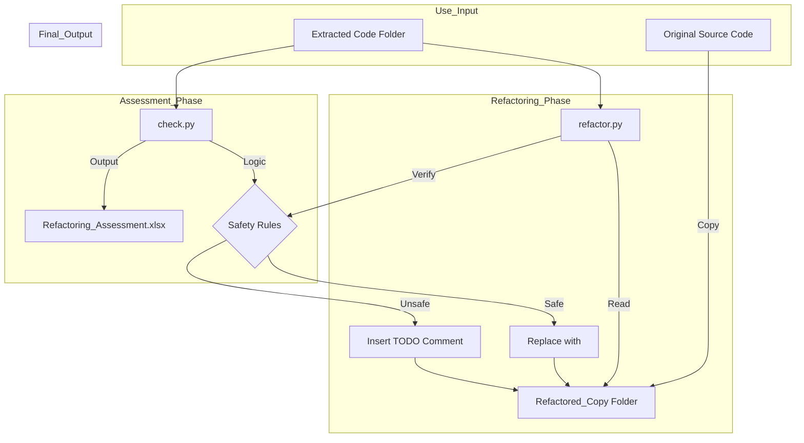

# Refactoring Utility Technical Specification

## 1. Executive Summary
The **Refactoring Utility** is the execution arm of the RepoScan suite. While `RepoScan-Analyser` identifies and measures technical debt, this utility **automates the remediation** process. It performs physical code refactoring by replacing inline code blocks (`<script>...</script>`) with external file references (`<script src="..."></script>`).

Crucially, it implements a **"Safety-First"** architecture: it operates on a complete copy of the codebase and includes strict logic to effectively block the extraction of code containing server-side dependencies (e.g., Razor, Classic ASP), preventing broken builds.

---

## 2. Architecture & Data Flow

The utility is composed of two distinct components:
1.  **Assessment Engine (`check.py`)**: Analyzes the *already extracted* code snippets to verify if they are safe to externalize.
2.  **Refactoring Engine (`refactor.py`)**: Generates a refactored copy of the application using the verification data.



---

## 3. Module Breakdown

### 3.1. Assessment Engine (`check.py`)
*   **Purpose**: Validates the quality and safety of code extracted by the main analyser.
*   **Input**: The `output/extracted_code` directory.
*   **Logic**:
    *   Parses metadata from filenames (e.g., `Home_Index.cshtml_scriptblock_L10.js`).
    *   Scans content for **Blockers**:
        *   `@Model`, `@ViewBag` (Razor)
        *   `<% %>` (Classic ASP)
        *   `document.write` (Unsafe JS)
    *   **Heuristic Scoring**:
        *   **Ready**: Standard JS logic.
        *   **Needs Rewrite**: Event handlers (`onclick`) that require modern event listeners.
        *   **Blocked**: Server-side code detected.
*   **Output**: `Refactoring_Assessment.xlsx` (A detailed audit log).

### 3.2. Refactoring Engine (`refactor.py`)
*   **Purpose**: Applies changes to the codebase.
*   **Working**:
    1.  **Isolation**: Creates a full copy of the `--root` directory to `--output`. **Never modifies source files in place.**
    2.  **Mapping**: Reverses the filename logic to find the original source file and line numbers.
    3.  **Safety Check**: Re-verifies the content of the extracted file. If it contains server tags, it **aborts** the replacement for that specific block.
    4.  **Transformation**:
        *   **Safe**: Replaces lines `10-25` with `<script src="/js/Home_Index...js"></script>`.
        *   **Unsafe**: Inserts a comment: `<!-- TODO: Refactor Blocked Script [Server-Side Logic Detected] -->` and leaves the original code untouched.
*   **Output**: A fully functional, refactored version of the application in the output folder.

---

## 4. Safety Mechanisms

The utility employs a "Do No Harm" policy.

1.  **Non-Destructive**:
    *   Refactoring is **always** performed on a separate copy.
    *   The original codebase is treated as Read-Only.

2.  **Server-Side Logic Detection**:
    *   Before replacing any block, the content is grep-scanned for patterns like `@Model`, `<%=`, `Response.Write`.
    *   **Rule**: If a single server-side tag is found, externalization is blocked. Moving such code to a `.js` file would break the application (browser cannot render C#).

3.  **Line-Mismatch Prevention**:
    *   Uses exact line numbers from the extraction phase.
    *   If the source file has changed since extraction (line count mismatch), the refactoring for that file is skipped to prevent corruption.

---

## 5. Advantages & Limitations

### 5.1. Advantages
*   **Automation**: reducing manual copy-paste work by 90% for standard logic.
*   **Risk Mitigation**: The "Blocked" logic prevents the #1 issue in legacy migration: accidentally moving server-rendered code to static files.
*   **Auditability**: The generated Excel report provides a paper trail of what was moved, what was skipped, and why.
*   **Zero-Downtime**: Developers can run this tool, review the "Refactored Copy", and if it passes tests, swap it with production code.

### 5.2. Limitations
*   **Formatting**: The replaced `<script src="...">` tags are inserted with basic indentation. It does not run Prettier/ESLint, so minor formatting (indentation) might be needed.
*   **Scope**: It currently handles **Script Blocks** and **Style Blocks** well. Complex inline attributes (like `onclick="huge_logic..."`) are currently marked with `TODO` comments rather than fully converted to `addEventListener`.
*   **Path Resolution**: The generated `src="/js/..."` paths are absolute. If the application is hosted in a virtual directory (e.g., `localhost/MyApp/`), these paths might need a prefix update (processed easily via Find & Replace).

---

## 6. Usage

```bash
# 1. Generate Assessment Report
python check.py --extracted "./output/extracted_code"

# 2. Perform Refactoring (on a copy)
python refactor.py --root "./LegacyApp" \
                   --extracted "./output/extracted_code" \
                   --output "./LegacyApp_Refactored"
```
