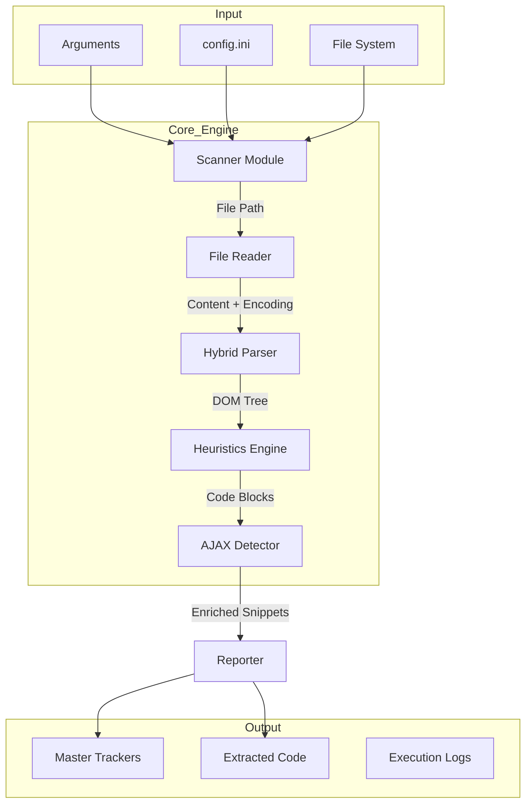

# RepoScan-Analyser Technical Specification v1.2

## 1. Executive Summary
**RepoScan-Analyser** is a high-precision static analysis utility tailored for legacy .NET web applications (WebForms, MVC, Classic ASP). Unlike generic linters, it focuses specifically on **Refactoring Readiness**—identifying, cataloging, and scoring client-side code (JavaScript, CSS, AJAX) based on strictness of coupling with server-side logic (`@Model`, `ASP.NET Code-Behind`).

It answers the core migration question: *"How difficult will it be to move this legacy code to a modern frontend framework (React/Angular)?"*

---

## 2. System Architecture

### 2.1. detailed Data Flow
The utility operates as a linear pipeline:
1.  **Discovery (Scanner)**: Recursively finds files, complying with inclusion/exclusion rules.
2.  **Ingestion (Reader)**: robustly reads files, handling legacy encodings (Windows-1252, UTF-8-BOM).
3.  **Parsing (Parser)**:
    *   **Phase A (DOM)**: Parses HTML/ASPX structure to identify `<script>`, `<style>`, and event attributes (`onclick`).
    *   **Phase B (Regex)**: Scans valid code blocks for specific patterns (AJAX, Dynamic Sinks).
4.  **Enrichment (Detectors)**:
    *   **AJAX Detector**: Classifies API calls (jQuery, XHR, Fetch) and extracts endpoints.
    *   **Logic Analyzer**: Calculates "Density" and "Severity" scores.
5.  **Output (Reporter)**:
    *   **Bundler**: Physically extracts code to `output/extracted_code/`.
    *   **Excel**: Generates multi-tabbed spreadsheets with traffic-light assessments.



---

## 3. Core Modules & Algorithms

### 3.1. Hybrid Parsing Engine (`src/parser.py`)
The parser solves the "Legacy Web" problem where code lives in three places:
1.  **Inline Attributes**: `<button onclick="doSomething()">`
2.  **Script Blocks**: `<script>...</script>`
3.  **External Files**: `.js` files.

**Algorithm:**
1.  **DOM Traversal**: Uses `BeautifulSoup4` with `html.parser`.
2.  **Sourceline Recovery**: Critical for reporting. Extracts exact line numbers (`tag.sourceline`).
3.  **Deduplication**: Hashes (File, StartLine, CodeType) to prevent duplicate reporting if Regex and DOM overlap.

### 3.2. Logic Density Scoring
Quantifies the complexity of a code block to determine if it's "Glue Code" (keep inline) or "Business Logic" (extract).

**Formula:**
```python
Score = 0
Score += 2 * (Count of 'if', 'for', 'while', 'function')
Score += 1 * (Count of AJAX calls, Event Listeners)
Score -= 2 * (Count of simple DOM selectors like $('#id')) # Penalty for pure glue
```
**Interpretation:**
*   **< 2 (Low)**: Likely simple UI toggles or glue.
*   **2 - 5 (Medium)**: Standard interaction logic.
*   **> 5 (High)**: Complex business logic. Candidate for refactoring.

### 3.3. Server Dependency Severity
Determines if code can be moved to a `.js` file without breaking.

| Severity | Triggers | Implication |
| :--- | :--- | :--- |
| **High** | `@Model.Prop`, `<% if %>`, `Response.Write` | **Blocking**. Logic depends on server-side rendering. Must be rewritten as API call. |
| **Medium** | `@Url.Action`, `@ViewBag` | **Rewrite**. Config/Routing dependency. Can be passed as data-attribute. |
| **Low** | `@DateTime`, simple vars | **Cosmetic**. Easy to replace. |
| **None** | No server tags | **Ready**. Safe to extract immediately. |

### 3.4. AJAX Detection (`src/ajax_detector.py`)
Uses a "Giant Regex" approach combined with functional classification.
*   **Scope**: Detects 90+ patterns including:
    *   **Modern**: `fetch`, `axios`, `async/await`
    *   **Legacy**: `$.ajax`, `new XMLHttpRequest`, `Prototype.js`
    *   **ASP.NET**: `__doPostBack`, `PageMethods`, `UpdatePanel`
*   **Endpoint Extraction**: Heuristic regexes to pull the URL string (e.g., extracts `/api/user` from `$.get('/api/user')`).

---

## 4. File Descriptions & Usage

This section details every Python component in the `src/` directory, explaining its internal working and how it contributes to the pipeline.

### 4.1. Core Application
| File | Role | Working | Usage |
| :--- | :--- | :--- | :--- |
| **`main.py`** | **Orchestrator** | 1. Sets up logging.<br>2. Parses CLI args via `src.config`.<br>3. Initializes `Scanner` to find files.<br>4. Loops files → `Parser` → `Findings List`.<br>5. Passes list to `Reporter` for Excel generation. | **Entry Point**. Run this file to start the tool.<br>`python main.py --root ./MyApp` |

### 4.2. Source Modules (`src/`)

#### **`src/scanner.py`**
*   **Role**: File Discovery.
*   **Working**: Uses `os.walk()` to traverse directories. Applies `config.include_extensions` (whitelist) and `config.exclude_folders` (blacklist). Checks file size limits to avoid memory crashes on massive logs.
*   **Usage**: Internal. Called by `main.py` Phase 1.

#### **`src/parser.py`**
*   **Role**: Analysis Engine.
*   **Working**: Contains the `Parser` class. It ingests raw file content, decides whether to use Regex (for `.js`) or BeautifulSoup (for `.html/.aspx`), and produces a list of `CodeSnippet` objects. It also orchestrates the calls to `ajax_detector` and `Logic Density` calculators.
*   **Usage**: Internal. The core intelligence of the tool.

#### **`src/reader.py`**
*   **Role**: I/O Utility.
*   **Working**: Implements safe file reading. It attempts to detect encoding using `chardet` (heuristic). If that fails, it falls back to `utf-8`, then `windows-1252` (common in legacy .NET). This prevents tool crashes on non-UTF8 legacy files.
*   **Usage**: Internal. Used by `main.py` before passing content to parser.

#### **`src/reporter.py`**
*   **Role**: Report Generator.
*   **Working**:
    1.  **Excel Generation**: Uses `openpyxl` to create `Code_Inventory.xlsx` and `Refactoring_Tracker.xlsx`. Encapsulates logic for cell formatting, color-coding (Traffic Light), and creating summaries.
    2.  **Code Bundling**: Iterates findings and writes them to the `output/extracted_code` directory with sanitized filenames.
*   **Usage**: Internal. Called by `main.py` Phase 3.

#### **`src/ajax_detector.py`**
*   **Role**: Pattern Recognition.
*   **Working**: A specialized module containing a massive library of Regex patterns. It analyzes `CodeSnippet` content to detect API calls, classify them (e.g., "Script Loading", "Data Exchange"), and extract the target URL.
*   **Usage**: Internal. Called by `parser.py` during enrichment.

#### **`src/config.py`**
*   **Role**: Configuration Management.
*   **Working**: Loads settings from `config.ini` and overrides them with CLI arguments (`argparse`). Validates paths.
*   **Usage**: Internal. Defines the `ScannerConfig` object passed to all other modules.

#### **`src/logger.py`**
*   **Role**: Diagnostics.
*   **Working**: Configures Python's `logging` module. Writes `INFO` logs to console and `WARNING/ERROR` logs to a timestamped file in `logs/`.
*   **Usage**: Internal. Used by all modules for tracing.

### 4.3. Crawler Modules (`src/crawler/`)
*Note: These are used when `--dynamic-analysis` or `--url` is specified.*

| File | Role | Working |
| :--- | :--- | :--- |
| **`crawler.py`** | **spider** | Manages the URL frontier and visiting logic using `selenium` or `requests`. |
| **`fetcher.py`** | **Network** | Handles HTTP requests, retries, and retrieving headers. |
| **`detector.py`** | **Analysis** | Analyzes HTTP responses (Headers, CSP) for security configurations. |

---

## 5. Data Structures

### 5.1. The `CodeSnippet` Class
The central data unit passed through the pipeline.

```python
class CodeSnippet:
    file_path: str       # Absolute path
    start_line: int      # 1-based index
    end_line: int
    category: str        # 'JS', 'CSS', 'External', 'Internal'
    code_type: str       # 'scriptblock', 'onclick', 'styleblock'
    full_code: str       # The actual raw code string
    source_type: str     # 'INLINE', 'LOCAL' (file), 'REMOTE' (http)
    
    # Analysis Fields
    ajax_detected: bool
    ajax_details: List[Dict] # Detailed breakout of multiple calls
    logic_density_score: int
    server_severity: str     # 'None', 'Low', 'Medium', 'High'
    complexity: str          # 'Low', 'Medium', 'High'
    functionality: str       # 'UI Interaction', 'Data', 'Validation'
```

---

## 6. Output Manifest

### 6.1. `Code_Inventory.xlsx` (The Master View)
| Tab Name | Content |
| :--- | :--- |
| **Summary** | High-level metrics (Total JS lines, Total AJAX calls). |
| **Inline JS** | Attribute-level JS (`onclick`). Often technical debt. |
| **Internal JS** | `<script>` blocks embedded in HTML. Primary extraction targets. |
| **External JS** | `.js` files and remote CDNs. Analyzed for AJAX. |
| **AJAX Code** | Dedicated view of every network call, endpoint, and capability. |

### 6.2. `Refactoring_Tracker.xlsx` (The Action Plan)
Designed for developers.

*   **Status Column (Traffic Light)**:
    *   🟢 **Ready**: No Server Severity.
    *   🟡 **Rewrite**: Medium Severity or High Complexity.
    *   🔴 **Blocked**: High Severity (Server-side logic embedded).
*   **Recommended Method**: e.g., "Move to separate file", "Convert to Component".
*   **Target Filename**: Suggested standardized name for the extracted file.

---

## 7. Configuration & Extensions

### 7.1. `config.ini`
Controls the `Scanner` behavior.
```ini
[Paths]
root_folder = .
output_folder = ./output

[Filters]
include_extensions = .html, .cshtml, .aspx, .js, .css
exclude_folders = node_modules, .git, bin, obj, test
exclude_files = jquery*.js, modernizr*.js  ; Wildcards supported
```

### 7.2. CLI Arguments
Overrides `config.ini`.
*   `--root`: Set scan target.
*   `--static-analysis`: Run standard scan.
*   `--extract`: Run physical file extraction based on logic.

---

## 8. Future Capability (Roadmap)
*   **Language Support**: Add Java/JSP parsing (similar to ASPX).
*   **AST Analysis**: Replace Regex for JS with true AST (Abstract Syntax Tree) parsing using `esprima` python bindings for deeper scope analysis.
*   **Dependency Graphing**: Visualizing which files import which other files.
