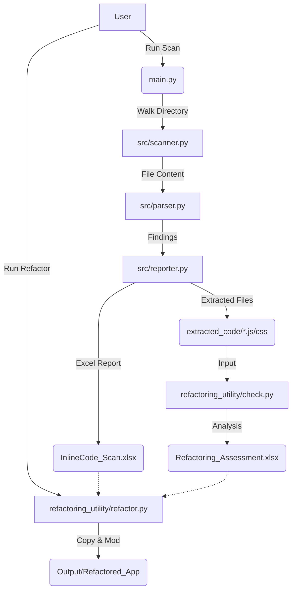
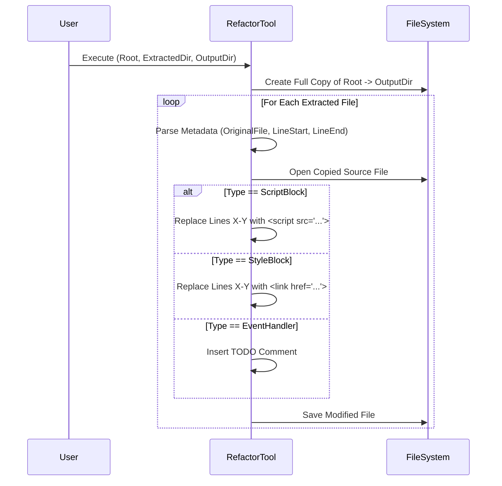

# Inline Code Scanner & Refactoring Utility

A comprehensive toolchain for auditing, assessing, and refactoring inline JavaScript and CSS to comply with strict Content Security Policy (CSP) requirements.

---

## 1. Project Overview
**Goal**: Enable strict CSP (`default-src 'self'`) in .NET/Web applications by automating the detection and remediation of inline code.

**Key Capabilities**:
1.  **Scan**: Identify all inline scripts, styles, event handlers, and `javascript:` URIs.
2.  **Assess**: Grade the difficulty of refactoring each file based on complexity.
3.  **Refactor**: Automatically move inline code to external files and update the source code in a safe, copy-first manner.

---

## 2. Quick Start & Installation

**Prerequisites**: Python 3.8+

```bash
pip install -r requirements.txt
```

### Directory Structure
```text
inline_scanner/
├── src/                # Core Logic (Scanner, Parser, Reporter)
├── refactoring_utility/# Refactoring Engine (Check, Refactor)
├── main.py             # Entry Point
└── output/             # ALL tool outputs go here
```

---

## 3. Workflow & Usage

### Step 1: Scan & Assess
Run the main scanner to audit your codebase.

```powershell
python main.py --root "C:\Path\To\YourApp" --output "output"
```

**Outputs (in `output/`)**:
*   `InlineCode_Scan_<Date>.xlsx`: Detailed audit report.
*   `Refactoring_Assessment.xlsx`: **The Tracker**. Prioritizes work:
    *   🟢 **Ready**: Safe to refactor automatically.
    *   🟡 **Needs Rewrite**: Event handlers (`onclick`) that need manual event listener attachment.
    *   🔴 **Blocked**: Server-side code (`@Model`, `<%= %>`) that requires logic changes.
*   `extracted_code/`: The actual `.js` and `.css` files extracted from your source.

### Step 2: Auto-Refactor
Generate a **refactored copy** of your application.

```powershell
python refactoring_utility/refactor.py --root "C:\Path\To\YourApp" --extracted "output/extracted_code" --output "output/Refactored_App"
```

**What happens:**
1.  Copies `C:\Path\To\YourApp` -> `output/Refactored_App`.
2.  **Script/Style Blocks**: Replaced with `<script src="...">` / `<link href="...">`.
3.  **Event Handlers**: Marked with comments (`<!-- TODO: Refactor onclick... -->`) for manual fix.

---

## 4. Output Structure
All outputs are strictly contained within the dashboard.

```
output/
├── extracted_code/
│   ├── inline_javascript/
│   │   └── page.html_scriptblock_line10-20.js
│   └── inline_css/
│       └── page.html_styleblock_line5-8.css
├── Refactoring_Assessment.xlsx  <-- Your Work Tracker
├── InlineCode_Scan_....xlsx     <-- Detailed Audit
└── Refactored_App/              <-- Your Modified Project Copy
```

---

## 5. Technical Design Specification

### 5.1 Architecture
The system uses a pipeline approach: Scan -> Parse -> Report -> Bundle -> Assess -> Refactor.



### 5.2 Refactoring Logic Flow
The refactoring utility ensures safety by **never modifying** the original source.



### 5.3 Core Modules

#### Parser Logic (`src/parser.py`)
Uses regex for robustness against mixed server-side tags:
*   **Script**: `<script[^>]*>(.*?)</script>`
*   **Events**: `\s(on\w+)=["']`
*   **Pseudo-Protocols**: `href=["']javascript:`

#### Assessment Logic (`refactoring_utility/check.py`)
Analyzes extracted content to determine safety:
*   **Blocked (Red)**: Contains ASP.NET/Razor tags (`<%`, `@Model`).
*   **Needs Rewrite (Yellow)**: Contains `document.write` or is an event handler.
*   **Ready (Green)**: Pure JS/CSS, safe for extraction.

#### Safety Mechanisms (`refactoring_utility/refactor.py`)
*   **Immutable Source**: Input directory is treated as read-only.
*   **Metadata Filenames**: `OriginalPath_Type_LineStart-LineEnd.js` stores all context needed for restoration.
