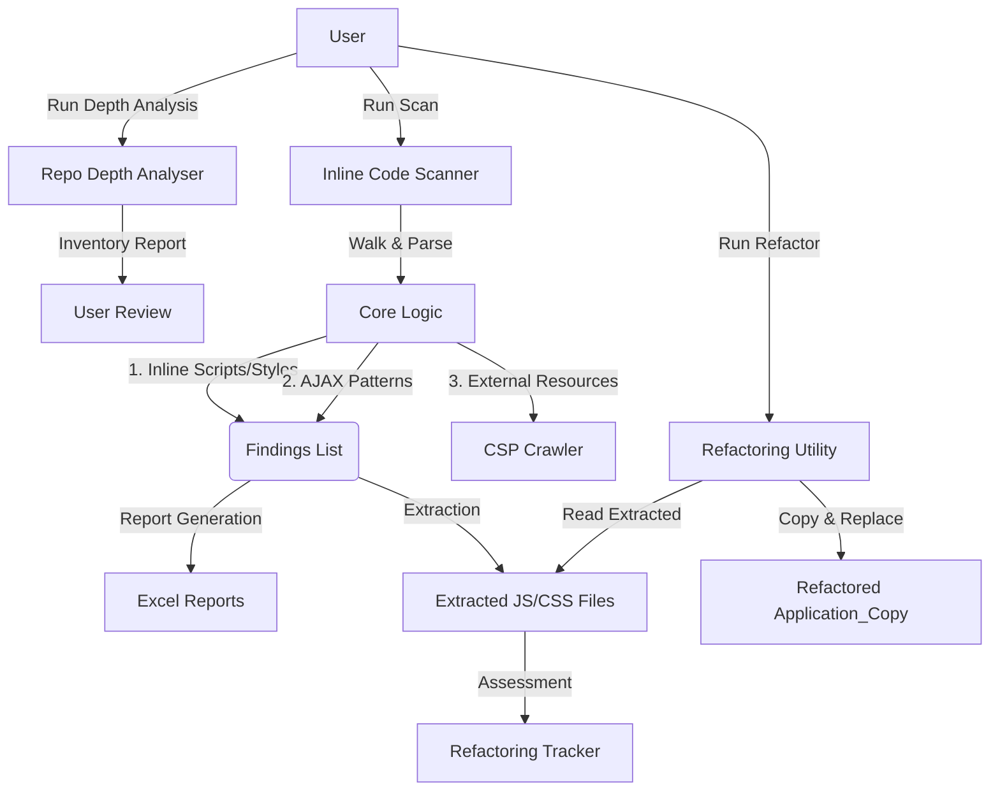

# Technical Design Specification: Automated Inline Code Refactoring Utility

## 1. Executive Summary

This document defines the architecture and implementation logic for a Python-based utility designed to analyze and remediate legacy web applications (specifically .NET/Web forms). The utility aims to reduce the attack surface by identifying inline JavaScript and CSS, assessing the complexity of extraction, and automating the refactoring process to external files. This enables the enforcement of strict CSP headers.

## 2. System Architecture

### 2.1 High-Level Design

The system operates as a multi-stage pipeline: **Static Inventory (Depth Analysis) -> Static Analysis (Scan) -> Heuristic Assessment (Assess) -> Non-Destructive Transformation (Refactor)**.



### 2.2 Functional Modules

Based on the implemented codebase, the system is divided into the following discrete modules:

| Module | Component Path | Responsibility | Input | Output |
| :--- | :--- | :--- | :--- | :--- |
| **Scanner** | `src.scanner` | Directory traversal and file filtering. | Root Path, Exclusion List | List of valid file paths. |
| **Parser** | `src.parser` | Regex & DOM parsing for code blocks. | File Content (String) | List of `CodeSnippet` objects. |
| **AJAX Detector** | `src.ajax_detector` | Analysis of AJAX calls and endpoints. | JS Snippets | Enriched `CodeSnippet` with endpoint & server deps. |
| **Reporter** | `src.reporter` | Data serialization to Excel. | `CodeSnippet` Objects | Detailed Excel Report, Extracted Files. |
| **Assessor** | `refactoring_utility.check` | Grading refactoring difficulty. | Extracted File Content | Status Enum (Green, Yellow, Red). |
| **Refactorer** | `refactoring_utility.refactor` | Safe file modification. | Source Path, Extracted Copy | New Source Directory (Refactored). |
| **Depth Analyser** | `repo_depth_analyser.src` | High-level repository inventory. | Target Directory | 3-Tab Inventory Tracker. |

## 3. Data Design & Schemas

### 3.1 Naming Convention: The "Metadata Protocol"

To maintain statelessness and avoid external databases, the system embeds source metadata directly into the filenames of extracted assets.

**Format**:
`{OriginalFilePath}_{BlockType}_L{StartLine}-L{EndLine}.{Extension}`

**Definitions**:
*   `OriginalFilePath`: Sanitized path of the source file (slashes replaced with underscores).
*   `BlockType`: `scriptblock`, `styleblock`, `onclick`, `jsuri`, etc.
*   `StartLine/EndLine`: Integer values representing the line numbers in the original source file.

### 3.2 Refactoring Assessment Logic

The `refactoring_utility.check` module applies heuristics to categorize risk.

| Refactorability | Color Code | Trigger Condition (Regex) | Remediation Strategy |
| :--- | :--- | :--- | :--- |
| **LOW** | **RED** | Code contains Server-Side Syntax:<br>• `<%= ... %>` (ASP.NET/Classic)<br>• `@Model` / `@ViewBag` (Razor)<br>• `{{ ... }}` (Templates) | **Manual Intervention**: Requires architectural changes to decouple server data from UI logic. |
| **MEDIUM** | **YELLOW** | Event Handlers: Files derived from `onclick`, `onload`, etc.<br>OR `document.write` present. | **Manual Rewrite**: Logic must be converted to `addEventListener` or DOM manipulation. |
| **HIGH** | **GREEN** | Code contains standard JavaScript/CSS without templating or event dependencies. | **Automated**: Safe to move to external file and reference via `<script src="...">`. |

## 4. Technical Logic Specification

### 4.1 Parsing Logic (Regex & DOM)

The parser utilizes a hybrid approach: **BeautifulSoup 4** for DOM traversal and **Regex** for pattern matching.

**Script Blocks**:
*   **Target**: `<script>` tags without `src` attributes.
*   **Logic**: Extracts text content using `soup.find_all('script')`.

**Style Blocks**:
*   **Target**: `<style>` tags.
*   **Logic**: Extracts text content using `soup.find_all('style')`.

**Inline Event Handlers**:
*   **Target**: Attributes starting with `on` (e.g., `onclick`, `onload`).
*   **List**: Covers Mouse, Keyboard, Form, Window, and Media events (approx. 40 event types).

**Pseudo-Protocols**:
*   **Pattern**: `href="javascript:..."` or `src="javascript:..."`.
*   **Logic**: Detected via regex `re.compile(r'href=["\']\s*javascript:', re.IGNORECASE)` and DOM attribute scan.

**AJAX Detection (Phase 2 Feature)**:
*   **Keywords**: `XMLHttpRequest`, `fetch`, `$.ajax`, `axios`.
*   **Logic**: If a JS snippet contains these keywords, it is flagged and passed to `src.ajax_detector` for endpoint extraction.

### 4.2 Refactoring Engine Workflow

This module performs the physical modification of the codebase.

1.  **Read Inputs**: Takes the **Root Source Directory** and the **Extracted/Assessed Code Directory**.
2.  **Clone**: Creates a full copy of the source to `output/Refactored_App`.
3.  **Iterate**: LOOPS through every extracted file in the `extracted_code` folder.
4.  **Parse Metadata**: Decodes `OriginalPath`, `StartLine`, `EndLine` from the filename.
5.  **Apply Change**:
    *   **If GREEN (Safe)**: Replaces lines `StartLine` to `EndLine` in the *copied* source file with an external reference: `<script src="/path/to/extracted.js"></script>`.
    *   **If YELLOW/RED**: Inserts a TODO comment above the block: `<!-- TODO: Refactor this block [ Reason: ... ] -->`.
6.  **Save**: Writes the modified content back to the `Refactored_App` file.

## 5. Implementation Constraints & Guidelines

### 5.1 Safety Mechanisms

*   **Immutability**: The tool must **never** modify the input directory. All write operations occur in a designated `output/` directory.
*   **Encoding**: All file operations must explicitly use `encoding='utf-8'` to prevent byte-order mark (BOM) corruption in Windows environments.
*   **Atomic Operations**: File writes should only occur after the full content string is processed in memory.

### 5.2 Technology Stack Prerequisites

*   **Runtime**: Python 3.8+
*   **Dependencies**:
    *   `openpyxl`: For generating high-fidelity audit reports.
    *   `pandas`: For data manipulation in reports.
    *   `beautifulsoup4`: For robust HTML/XML parsing.
    *   `lxml`: For high-performance parsing fallback.

## 6. Directory Structure

The application structure is designed for modularity and separation of concerns.

```text
RepoScan/
├── repo_depth_analyser/    # Inventory Tool
│   ├── src/                # Analyzer Logic
│   └── main.py             # Entry Point for Depth Analysis
├── src/                    # Core Scanner Logic
│   ├── crawler/            # External Resource Crawler
│   ├── ajax_detector.py    # AJAX Analysis
│   ├── parser.py           # Parsing Logic
│   ├── scanner.py          # Traversal Logic
│   └── reporter.py         # Excel Generation
├── refactoring_utility/    # Refactoring Engine
│   ├── check.py            # Heuristic Assessment
│   └── refactor.py         # Copy & Replace Engine
├── output/                 # ALL tool outputs go here
├── main.py                 # Primary Scanner Entry Point
└── requirements.txt
```

## 7. Detailed Implementation Phases

### Phase 1: Foundation (Scan & Report) - DONE
*   **Goal**: Accurate detection and reporting of all inline code.
*   **Status**: Complete. `main.py` runs the full scan and generates the `InlineCode_Scan.xlsx` report with tabs for JS, CSS, and External Resources.

### Phase 2: Enhanced Analysis (AJAX & Inventory) - DONE
*   **Goal**: Deeper insight into API usage and repo structure.
*   **Status**: Complete.
    *   **Repo Depth Analyser**: Provides file counts and extension stats (excluding noise like `.git`).
    *   **AJAX Module**: Detects calls to backend services during the scan.

### Phase 3: Assessment & Refactoring - DONE
*   **Goal**: Automated assessment and safe refactoring.
*   **Status**: Complete.
    *   `check.py` accurately categorizes complexity (Green/Yellow/Red).
    *   `refactor.py` successfully generates a safe copy of the app with externalized scripts.

## 8. Error Handling & Logging

To ensure a professional and reliable utility, the following logging standards are required:

*   **Log Levels**: Use `INFO` for general progress, `WARNING` for skipped files (e.g., permission denied), and `ERROR` for regex failures or IO issues.
*   **Recovery**: If the Refactorer fails midway, the script must delete the partial `Refactored_App` directory to prevent stale or corrupted builds.
*   **Integrity Checks**: Before refactoring, the tool should verify that the number of extracted blocks in the "Scan Report" matches the number of files in the "Extracted Assets" folder.

## 9. System Limitations & Constraints

### 9.1 Architectural Scope Limitations
The utility is designed as a **Static Refactoring Assistant**, not a compiler.
*   **Server-Side Dependency (Hard Block)**: The utility cannot externalize code containing server-side interpolation (e.g., `<%= %>`, `@Model`).
*   **State Management**: The tool cannot automatically transition code that relies on server-side state into a data-attribute or API-driven model.

### 9.2 Automation Constraints
*   **Event Handler Decoupling**: The tool identifies `onclick` but does not auto-generate `addEventListener` logic due to complexity in unique ID generation.
*   **CSS Semantic Naming**: Automated conversion of `style="..."` to CSS classes is excluded to prevent "utility class soup."
