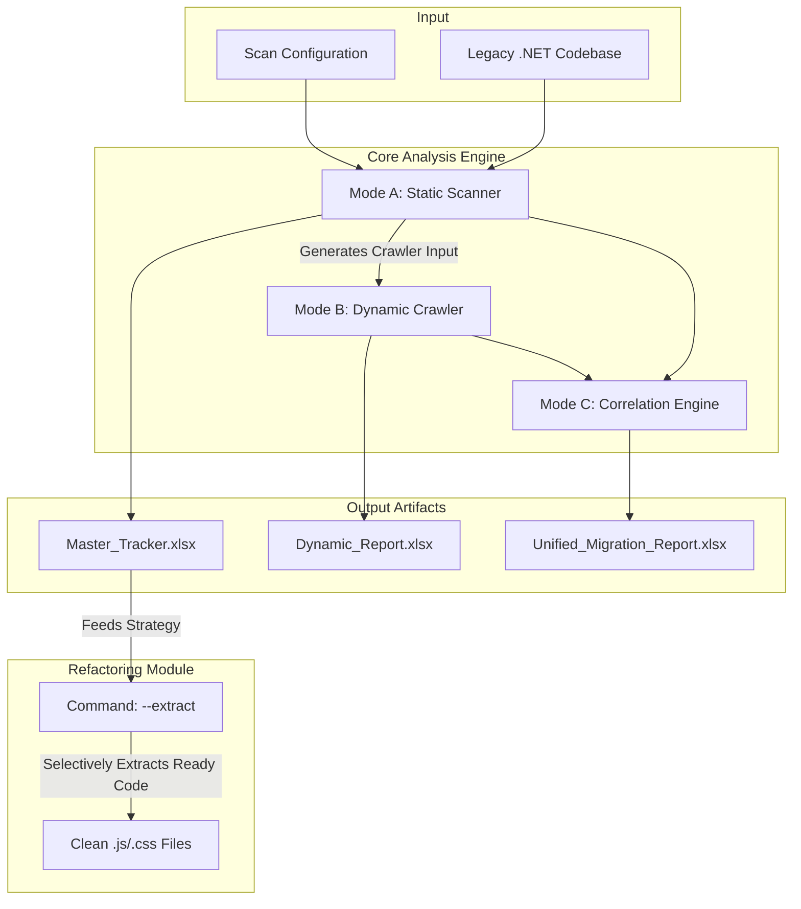
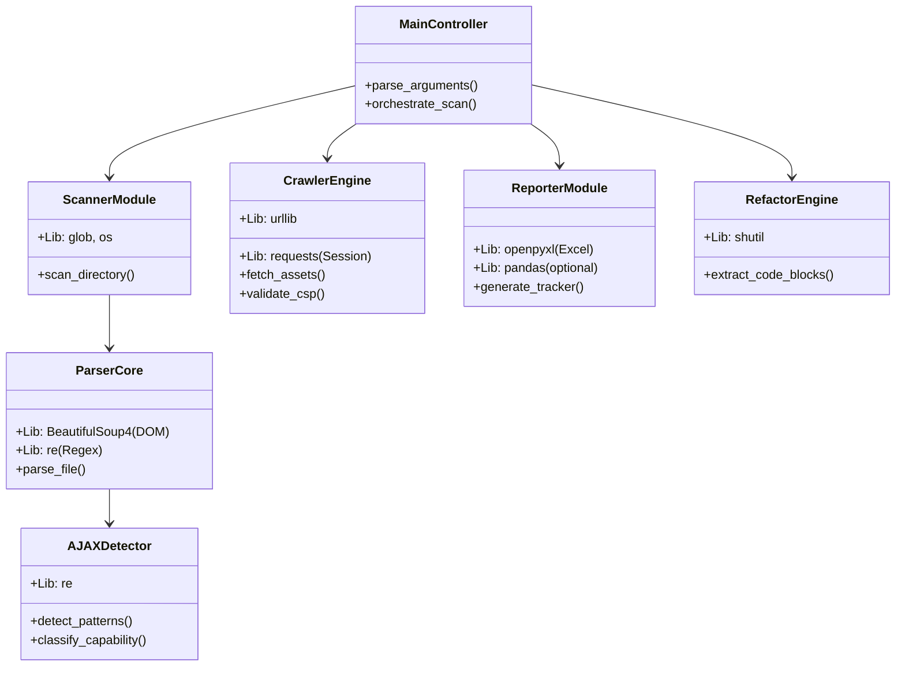

# Analysis Module Implementation Plan (Master Design)

**Objective**: Build a comprehensive analysis tool for .NET Legacy Applications code migration that combines Static Analysis (Source) and Dynamic Analysis (Crawler) to generate a unified "Migration Tracker".

## 1. System Architecture

The utility operates in three distinct modes, powered by a modular Python-based architecture.

### High-Level Workflow

### Component Architecture & Tech Stack
The system is built using **Python 3.9+** and leverages the following modules and libraries:

---

## 2. "Master Tracker" Excel Specification
The output file will have the following structured tabs:

### Tab 1: Comprehensive Findings ("The Code Inventory")
*   **Purpose**: Raw inventory of every detectable asset.
*   **Columns**:
    1.  **File Path**: `Views/Home/Index.cshtml`
    2.  **Type**: `Inline JS`, `Script Block`, `CSS`, `AJAX`
    3.  **Source Type**: `Inline`, `Internal (Local)`, `External`
    4.  **Lines**: `10-25`
    5.  **Snippet**: First 100 chars of code.

### Tab 2: AJAX Detailed Report ("The Logic Map")
*   **Purpose**: Distinguish "Real" migration work from configuration noise.
*   **Columns**:
    1.  **File**: `UserService.js`
    2.  **Snippet**: `$.ajax({ url: ... })`
    3.  **Is Real AJAX?**: `Yes` (Trigger) / `No` (Config/Setup)
    4.  **Endpoint**: `/api/users/get` (or `Dynamic/Variable`)
    5.  **Capability**: `Data Exchange`, `UI Injection`
    6.  **Difficulty**: `Easy` (JSON), `Hard` (Script Injection)

### Tab 3: Crawler Input Generation ("The Hand-Off")
*   **Purpose**: Ready-to-use list for Mode B (Dynamic Scan).
*   **Logic**: Filters Tab 1 for `.aspx`, `.html` files and formats them as URLs.
*   **Columns**:
    1.  **Target URL**: `http://localhost/Views/Home/Index.cshtml` (Mapped from File Path)
    2.  **Rationale**: `Contains 5 Inline Scripts` (Prioritize heavy pages)

### Tab 4: Refactoring & Extraction Tracker ("Developer Checklist")
*   **Purpose**: The central checklist for developers. Tracks every block of code, its status, and how to fix it.
*   **Columns**:
    1.  **Ref ID**: Unique ID (e.g., `JS-1025`) for ticket tracking.
    2.  **Location**: `Views/Home/Index.cshtml : Lines 12-45`
    3.  **Code Type**: `Script Block` / `Inline Event` / `AJAX Call`.
    4.  **Functionality**: (Inferred) e.g., "Form Validation", "UI Update", "Server Postback".
    5.  **Complexity**: `Low` / `Medium` / `High`.
    6.  **Extraction Status**:
        *   🟢 **Extracted**: Successfully moved to file.
        *   🟡 **Skipped (Rewrite)**: Too complex for auto-extract. Manual fix needed.
        *   🔴 **Skipped (Blocked)**: Tightly coupled server code.
    7.  **Target Filename**: Code must follow strict convention: `{OriginalFilePath}_{BlockType}_L{StartLine}-L{EndLine}.{Extension}`
        *   Example: `Views_Home_Index_cshtml_ScriptBlock_L12-L45.js`
    8.  **Recommended Refactoring Method**:
        *   "Move to separate JS file"
        *   "Convert to React Component"
        *   "Replace with API Call"
        *   "Remove (Legacy)"
    9.  **Dev Notes**: Empty column for developers to mark "Done" or "In Progress".

### Tab 5: CSP & Correlation (Combined Mode Only)
*   **Purpose**: What did potential runtime checks find that static missed?
*   **Columns**:
    1.  **Origin Page**: `Login.aspx`
    2.  **Resource**: `https://analytics.google.com/ga.js`
    3.  **Detection Method**:
        *   `Static`: Found in `<script src="...">`
        *   `Dynamic`: Found via Runtime Injection (Crawler)
    4.  **CSP Action**: "Add to `script-src` whitelist".

---

## 3. .NET Legacy Specifics (Priority)

*   **Server-Side Blockers**:
    *   `@Model.*`, `@ViewBag`, `@ViewData` (Razor)
    *   `<%= %>`, `<% %>` (WebForms/Classic ASP)
    *   `runat="server"` (WebForms Controls)
*   **Legacy AJAX Patterns**:
    *   `UpdatePanel`, `ScriptManager` (Partial Rendering)
    *   `PageMethods.MyFunction()` (RPC)
    *   `__doPostBack(...)` (Postback wiring)

## 4. Implementation Workflow (.NET Focus)

1.  **Phase 1: Analysis Module (The Scanner)**:
    *   Enhance regex parser with the .NET patterns above.
    *   Generate the "Master Tracker".
    *   **NO physical extraction** happens here. Purely analytical.

2.  **Phase 2: Correlation Engine**:
    *   Map Static URLs to Dynamic Crawler Findings.

3.  **Phase 3: Refactoring Module (The Extractor)**:
    *   New Command: `python main.py --extract`
    *   **Selective Logic**:
        *   Reads "Refactoring Assessment" status.
        *   If `Status == Ready` or `Needs Rewrite` -> Extract to `.js/.css` file.
        *   If `Status == Blocked` -> **SKIP**. (Extracting these creates invalid JS files).
        *   Generates a "Migration Manifest" JSON linking legacy files to extracted files.

---

## 5. Phase 4: Accuracy Enhancements (Logic & Dependency Depth)

To reach >90% refactoring accuracy, the system will implement these specific logic improvements:

### 1. Logic Density Score (Prevent Useless Extraction)
*   **Problem**: Extracting "Page Glue" (DOM selection, event binding) is wasteful.
*   **Solution**: Calculate a score per block.
    *   `+2`: Function declarations, Loops, Conditions.
    *   `+1`: AJAX Calls.
    *   `-2`: Only DOM selectors + Event Binding.
*   **Impact**: Low-density blocks remain `INLINE` (marked as "Glue Code"). High-density blocks are candidates for `EXTRACTION`.

### 2. Server Dependency Severity (Nuanced Blocking)
*   **Problem**: Not all `@Model` usage is a blocker.
*   **Solution**: Classify dependency types.
    *   **Low (Cosmetic)**: `@ViewBag.Title`, `<%= Year %>` -> **Replaceable**.
    *   **Medium (Config)**: `@Url.Action` -> **Needs API Config**.
    *   **High (Logic)**: `@Model.UserId` inside logic -> **Backend Redesign**.

### 3. Interactive Crawler Hints (Runtime Coverage)
*   **Problem**: Crawler misses Admin panels or complex flows.
*   **Solution**: Add "Interaction Hint" column to Crawler Input.
    *   Example: `Login as Admin`, `Click 'Submit'`.
    *   Allows manual/scripted extension of the crawler path.

---

## 6. Roadmap & Limitations

While achieving 100% semantic accuracy requires tools like Babel or CodeQL, this utility prioritizes **Migration Velocity** (80/20 Rule).

| Advanced Feature | Current Approach | Why? |
| :--- | :--- | :--- |
| **Call Graph / Semantic Analysis** | **Regex Signature Matching** | Building a full JS/C# compiler is overkill for inventory. Regex is faster and finds 95% of targets. |
| **Multi-Stage Tokenizer** | **Robust Text Parsing** | Parsing raw `.cshtml/aspx` is messy. We rely on finding *known patterns* rather than validating full syntax trees. |
| **Live Runtime Analysis** | **Static-Fed Crawler**| We use a lightweight crawler to validate CSP, rather than heavy Playwright traces, to keep the tool portable. |

**Mitigation**: The "Refactoring Assessment" (Tab 4) explicitly includes a **Human-in-the-loop** workflow via the "Dev Notes" and "Review" status to catch the edge cases static analysis misses.
